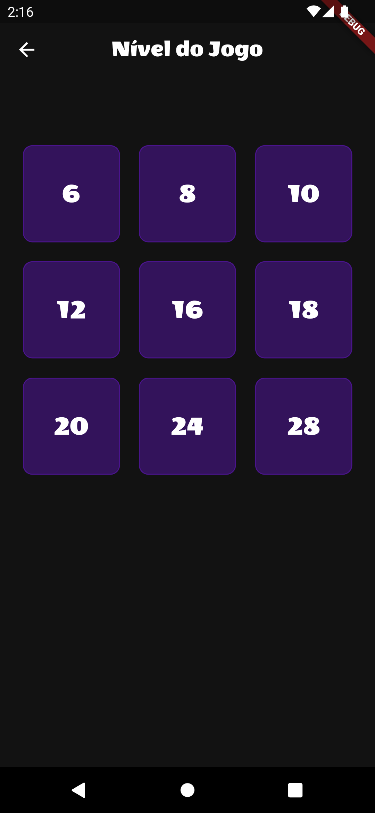
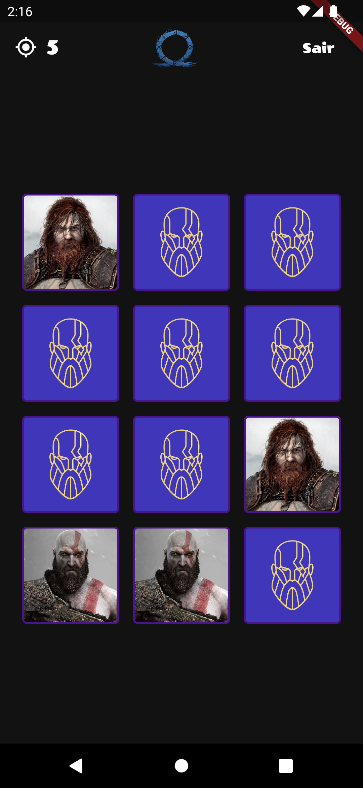
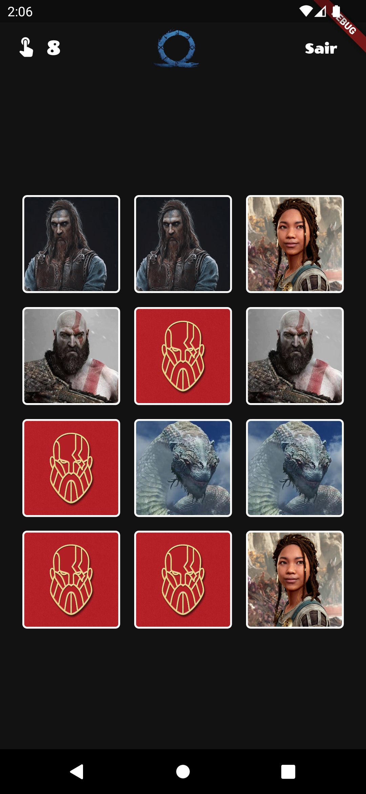

<h1 align="center">God of War - Memory Game (Ω)</h1>
<p align="center">
  
  
  
  
</p>

## :iphone:  About the Project

This project involves the development of a themed Memory Game with characters from God of War.

The project was based on the video playlist by [Prof. Diego Antunes](https://cutt.ly/j2chk8X).

## :camera: Screenshots

<div align="center">
  
  
  
</div>

## :rocket:  Technologies

- [Flutter](https://flutter.dev/)
- [Dart](https://pub.dev/)
- [MobX](https://pub.dev/packages/flutter_mobx)
- [Google Fonts](https://pub.dev/packages/google_fonts)
- [Github](https://github.com)

## :computer: How to Run

```bash
# Clone the Repository
$ git clone https://github.com/WallaceHolanda/gow_memory_game.git

# Install dependencies
$ flutter pub get

# Run App
$ flutter run
```

## :page_facing_up: Licence

This project is under the [MIT License](./LICENSE)

Made by Wallace Holanda.
